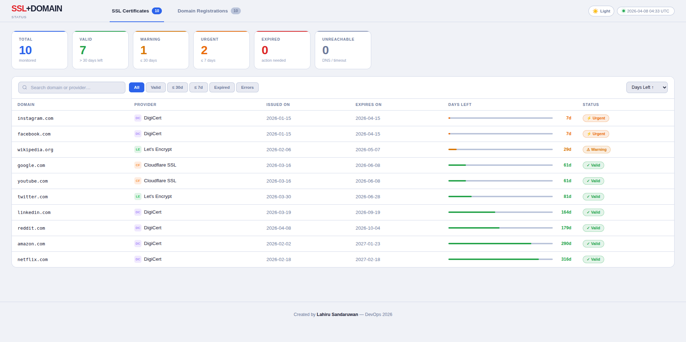
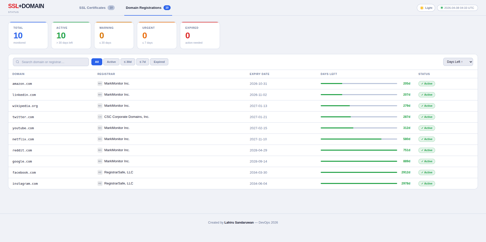

# DOMAIN + SSL status checker

## Screenshots

### SSL Certificates


### Domain Registrations


---

webLankan SSL Checker is a lightweight monitoring toolkit for:

- SSL/TLS certificate health checks
- Domain expiry tracking
- Config validation and auto-cleaning

It reads domain lists from plain text config files, runs checks in parallel, and writes JSON outputs that can be consumed by the dashboard or automation.

## Features

- SSL certificate inspection
- Detects provider/issuer (Let's Encrypt, Cloudflare, DigiCert, and more)
- Reports issue date, expiry date, remaining days, and status
- Handles common SSL failures (expired, hostname mismatch, self-signed, DNS/timeout/no HTTPS)
- Domain expiry checks
- Uses RDAP and WHOIS fallback for global domains
- Uses register.domains.lk API helper for .lk domains
- Normalizes registrar names (for cleaner reporting)
- Pre-run config validator and auto-fixer
- Validates malformed entries
- Removes duplicates
- Normalizes values (lowercase, strips protocol/path/www)
- Optional DNS reachability checks
- Rewrites cleaned files in place
- JSON outputs for dashboard/CI usage

## Project Files

- `domains.conf` - Input list for domain expiry checks
- `ssl.conf` - Input list for SSL certificate checks
- `domain_results.json` - Output from expiry checker
- `ssl_results.json` - Output from SSL checker
- `src/validate_conf.py` - Config validator + auto-fixer
- `src/domain/scripts/check_domains.py` - Domain expiry checker
- `src/domain/scripts/check_LK_domains.py` - .lk expiry helper
- `src/ssl/scripts/check_ssl.py` - SSL checker

## Configuration Files

### domains.conf

Repository link:
https://github.com/weblankan-lk/webLankan_ssl_checker/blob/main/domains.conf

Purpose:

- Used by the domain expiry checker
- One domain per line
- Supports comments and blank lines

Accepted examples:

```text
example.com
www.example.org
https://sample.net/path
```

What the tool does automatically:

- Converts to lowercase
- Removes http:// and https://
- Removes paths and trailing dots/spaces
- Removes leading www.
- Deduplicates entries

### ssl.conf

Repository link:
https://github.com/weblankan-lk/webLankan_ssl_checker/blob/main/ssl.conf

Purpose:

- Used by the SSL certificate checker
- One domain per line
- Supports comments and blank lines

Accepted examples:

```text
example.com
api.example.com
https://portal.example.org/login
```

What the tool does automatically:

- Converts to lowercase
- Removes protocol, path, trailing dots/spaces
- Deduplicates entries
- Skips obviously invalid malformed entries

## Requirements

- Python 3.10+
- Python package: cryptography

Install dependency:

```bash
pip install cryptography
```

## Usage

Run from repository root.

### 1. Validate and clean config files (recommended first)

```bash
python3 src/validate_conf.py
```

Skip DNS checks for faster cleanup:

```bash
python3 src/validate_conf.py --no-dns
```

Validate only one file:

```bash
python3 src/validate_conf.py ssl.conf
```

### 2. Run SSL checks

```bash
python3 src/ssl/scripts/check_ssl.py
```

Output is written to `ssl_results.json`.

### 3. Run domain expiry checks

```bash
python3 src/domain/scripts/check_domains.py
```

Output is written to `domain_results.json`.

## Environment Variables

- `DOMAIN_CHECK_DELAY_SEC` - Delay between outbound domain lookup requests (default: 0.35)
- `LK_CHECK_DELAY_SEC` - Delay for .lk API requests (default: 0.8)
- `LK_CHECK_MAX_RETRIES` - Retry count for .lk API failures (default: 3)

Example:

```bash
DOMAIN_CHECK_DELAY_SEC=0.5 LK_CHECK_MAX_RETRIES=5 python3 src/domain/scripts/check_domains.py
```

## Result Status Meanings

SSL status values commonly include:

- `valid`
- `expired`
- `invalid`
- `dns_error`
- `timeout`
- `ssl_error`
- `no_https`
- `error`

Domain expiry status values commonly include:

- `active`
- `warning`
- `urgent`
- `expired`
- `unknown`

## Suggested Workflow

1. Update `domains.conf` and `ssl.conf`.
2. Run `python3 src/validate_conf.py`.
3. Run SSL and domain checks.
4. Use `ssl_results.json` and `domain_results.json` in your dashboard/automation.

## GitHub Actions Automation

The repository includes a GitHub Actions workflow (`.github/workflows/ssl-check.yml`) that runs checks automatically and deploys the dashboard to Cloudflare Pages.

### Schedule

Runs automatically every day at **06:00 Asia/Colombo (UTC+5:30)**, equivalent to **00:30 UTC**.

Can also be triggered manually from the GitHub Actions tab using the **workflow_dispatch** option.

### What the workflow does

1. Validates `ssl.conf` and `domains.conf`
2. Runs SSL certificate checks → updates `ssl_results.json`
3. Runs domain expiry checks → updates `domain_results.json`
4. Commits the updated result files back to the `main` branch
5. Deploys the dashboard to Cloudflare Pages

### Required GitHub Secrets

Add these secrets to your repository under **Settings → Secrets and variables → Actions**:

| Secret | Description |
|---|---|
| `CLOUDFLARE_API_TOKEN` | Cloudflare API token with Pages edit permission |
| `CLOUDFLARE_ACCOUNT_ID` | Your Cloudflare account ID |

### Live Dashboard

The dashboard is deployed to Cloudflare Pages and updates automatically after each workflow run:

**https://ssl-domain-monitor.pages.dev**

